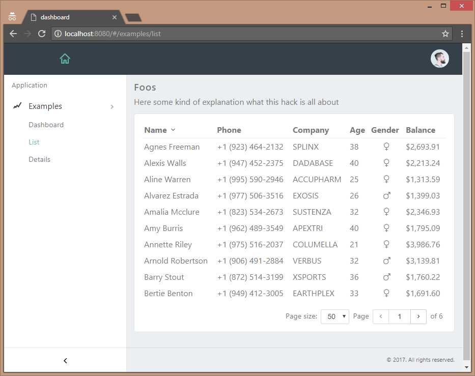

# UiBase

A toolkit for building data driven dashboard like applications.

Status: In development



## Components

- Grid
- Form
- Panel
- Sidebar
- Topbar

## Events

- `sidebartoggle` Toggles the sidebars open/close state

### Broadcasting events

  from HTML
```
  <button v-on:click.stop="$broadcast('someevent', { foo: 'bar' })">
    <i class="dripicons-plus"></i>
  </button>
```
  or inside of a component
```
  this.$broadcast('someevent', { foo: 'bar' })
```
